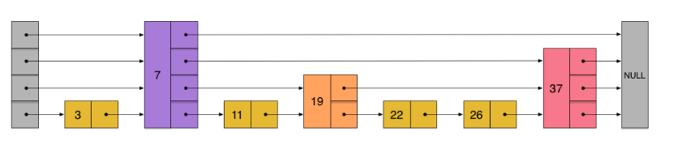

# LeetCode1206 设计跳表 题解

## 一、题目描述

不使用任何库函数，设计一个跳表。

跳表中有很多层，每一层是一个短的链表。在第一层的作用下，增加、删除和搜索操作的时间复杂度不超过 O(n)。跳表的每一个操作的平均时间复杂度是 O(log(n))，空间复杂度是 O(n)。

在本题中，你的设计应该要包含这些函数：

`bool search(int target)` : 返回target是否存在于跳表中。
`void add(int num)`: 插入一个元素到跳表。
`bool erase(int num)`: 在跳表中删除一个值，如果 num 不存在，直接返回false. 如果存在多个 num ，删除其中任意一个即可。


## 二、分析

跳表这一数据结构，操作就是「查找」，「插入」，「删除」，需要注意 **内部节点有指针数组，以代表不同层，==跳表的分层体现在节点的指针数组中==**。

跳表「查找」操作是基础，**从最高层开始，每层找到最后一个小于目标值的位置，然后进入下一层，直到最后一层**。

**「插入」和「删除」操作还要记录每层到达的最后一个位置（存在数组中），以方便更新指针**。




## 三、代码

```c++
struct Node {
    int val;
    vector<Node *> next;

    Node() = default;
    Node(int val, int level) : val(val), next(level, nullptr) {}
};

class Skiplist {
public:
    Node *head;

    Skiplist() : head(new Node(INT32_MIN, 32)) {
        srand(time(0));
    }

    bool search(int target) {
        Node *p = head;
        for (int i = 31; i >= 0; i--) {
            while (p->next[i] != nullptr && p->next[i]->val < target) p = p->next[i];
        }
        return p->next[0] == nullptr ? false : p->next[0]->val == target;
    }

    int generate_level() {
        int level = 1;
        while ((rand() & 1) && (level < 32)) level++;
        return level;
    }

    void add(int num) {
        Node *p = head;
        vector<Node *> update(32, nullptr);
        for (int i = 31; i >= 0; i--) {
            while (p->next[i] != nullptr && p->next[i]->val < num) p = p->next[i];
            update[i] = p;
        }
        int level = generate_level();
        Node *node = new Node(num, level);
        for (int i = 0; i < level; i++) {
            node->next[i] = update[i]->next[i];
            update[i]->next[i] = node;
        }
    }

    bool erase(int num) {
        Node *p = head;
        vector<Node *> update(32, nullptr);
        for (int i = 31; i >= 0; i--) {
            while (p->next[i] != nullptr && p->next[i]->val < num) p = p->next[i];
            update[i] = p;
        }
        if (p->next[0] == nullptr || p->next[0]->val != num) return false;
        p = p->next[0];
        int level = p->next.size();
        for (int i = 0; i < level; i++) update[i]->next[i] = p->next[i];
        delete p;
        return true;
    }

    void output() {
        Node *p = head;
        while (p->next[0] != nullptr) {
            cout << p->next[0]->val << " ";
            p = p->next[0];
        }
        cout << endl;
    }
};
```

