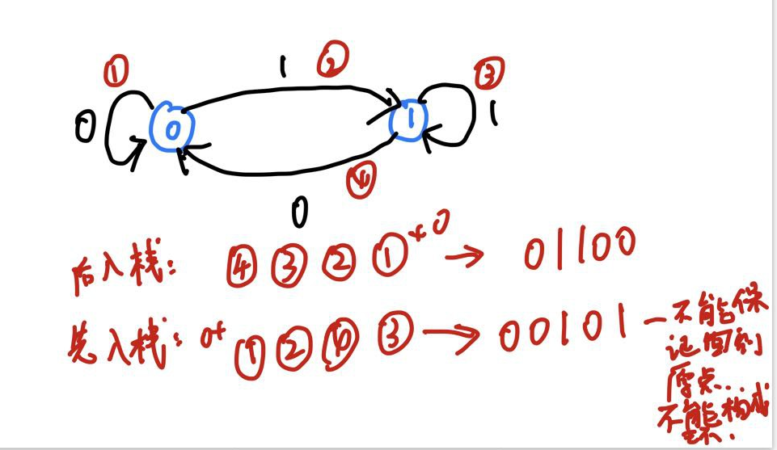

# Hierholzer算法正确性证明

## 1. 欧拉图

Hierholzer算法是用来求解欧拉图中的欧拉回路。欧拉回路是指通过所有边并回到起点的回路。

无向图是欧拉图当且仅当：

+ 非零度顶点是连通的
+ 顶点的度数都是偶数

有向图是欧拉图当且仅当：

+ 非零度顶点是强连通的
+ 每个顶点的入度和出度相等


## 2. Hierholzer算法

现在的Hierholzer算法的流程：

```
void dfs(int ver)
{
    对于ver的所有边:
    {
        if(未访问过)
        {
            则标记为已访问
            dfs(这条边所连之点)
        }
    }
    ver 入栈
}

对栈输出即可，栈顶即为第一个元素
```

理解Hierholzer算法的关键：

+ **访问了一个点的所有边再对该点入栈**，
+ 最后输出栈中元素即可获得欧拉回路。


## 3. 访问了一个点的所有边再对该点入栈

举个反例就行，同时记住**只有访问完一个点的所有边再将该点入栈才能保证回到起点**，**即入栈的点一定是所有边都被访问/删掉的**。




## 4. 证明：如果图中有欧拉回路，则第一个入栈的一定是起点

因为入栈的元素一定所有边都被访问/删掉了，即该点的度数为0，从起点到该点的路径除了起点和终点，度数减少了偶数个（一进一出），如果起点和终点不是同一个点，则存在度数为奇数的点，这和欧拉回路性质矛盾。

因此，**Hierholzer算法保证入栈的点一定是边都被访问过/删除的，这保证了第一个入栈的点是起点**。


## 5. 证明：第二个入栈的必定与起点有边连接

假设起点A，回溯到上一个点B，即B与A一定有边连接，所以才会有DFS(A)：

+ 如果B此时没有边，则B入栈，得证。
+ 如果B还有边，则以B为起点进行Hierholzer算法，B一定是该子过程中第一个入栈的，也就是整体第二个入栈的，得证。


> P.S. 对出边进行排序后就可以获得字典序最小的欧拉回路。
>
> 此外，如果要考虑边的话：
>
> ```
> void dfs(int ver)
> {
>     对于ver的所有边:
>     {
>         if(未访问过)
>         {
>             则标记为已访问
>             dfs(这条边所连之点)
>             处理该边
>         }
>     }
>     ver 入栈
> }
> 
> 对栈输出即可，栈顶即为第一个元素
> ```

