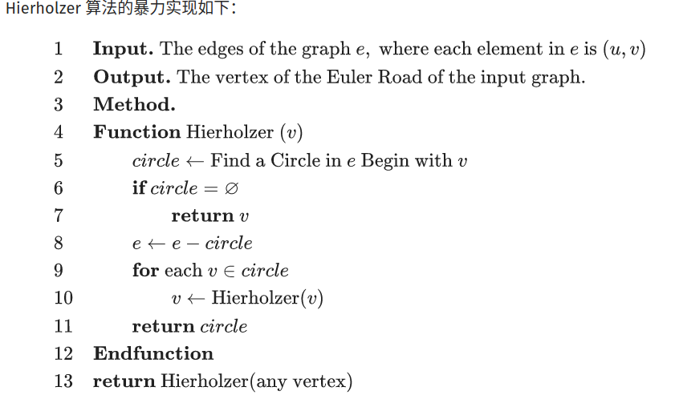

# LeetCode5932 合法重新排列数对 题解

## 一、题目描述

给你一个下标从 0 开始的二维整数数组 pairs ，其中 pairs[i] = [starti, endi] 。如果 pairs 的一个重新排列，满足对每一个下标 i （ 1 <= i < pairs.length ）都有 endi-1 == starti ，那么我们就认为这个重新排列是 pairs 的一个 合法重新排列 。

请你返回 任意一个 pairs 的合法重新排列。

注意：数据保证至少存在一个 pairs 的合法重新排列。

提示：

+ 1 <= pairs.length <= 10^5
+ pairs[i].length == 2
+ 0 <= starti, endi <= 10^9
+ starti != endi
+ pairs 中不存在一模一样的数对。
+ 至少 存在 一个合法的 pairs 重新排列。


## 二、分析

这是一道求解有向图欧拉回路 / 欧拉路径的问题。**求解欧拉回路 / 路径 一般使用DFS，比较常用的是优化后的Hierholzer 算法 [逐步插入回路法] （找回路的DFS和Heirholzer算法合并）**。

暴力Heirholzer算法：



暴力Hierholzer的时间复杂度是$O(M(M+N))$，思想是先找一个点的回路，删去回路，对该回路上的点DFS。

**优化的Hierholzer算法：从任意顶点开始DFS，先找相邻顶点的欧拉回路，再逆序插入边**。

有向图欧拉回路的判定与查找：所有顶点的入度和出度相同，从任意顶点出发DFS（执行Hierholzer算法）就可以找到一条欧拉回路，找欧拉回路的过程中，**需要注意逆序构造回路（即逆序插边）** 对顶点A，选择一条出边$A\to B$，删去该边，之后对B进行DFS，执行完后将$A\to B$插入回路中，这样做是为了保证其他回路能够被遍历。「考虑图中存在环的情况，例如[[1, 2], [2, 1], [1, 3]]，如果先把[1, 3]加到结果中就会无路可走，**逆序插入保证了先把环路走完**」，因为是逆序插入回路，所以最后需要reverse一下。**该Hierholzer算法的时间复杂度是$O(N+M)$**。

有向图欧拉路径的判定与查找：至多有0个或2个顶点的入度和出度相差1，**选择出度更大的那个顶点执行DFS**，就可以找到一条欧拉路径。其余同上。


## 三、代码

```c++
int wzmw_zr = 0;
bool fuck_plagiarism_system_of_leetcode = true;

void dfs(int ind, unordered_map<int, vector<int>> &mp, vector<vector<int>> &ans) {
    while (mp[ind].size()) {
        int next = *(mp[ind].rbegin());
        mp[ind].pop_back();
        dfs(next, mp, ans);
        ans.push_back({ind, next});
    }
}

vector<vector<int>> validArrangement(vector<vector<int>> &pairs) {
    unordered_map<int, vector<int>> out;
    unordered_map<int, int> in_deg;
    for (auto x : pairs) {
        for (auto y : x) if (!out.count(y)) out[y] = vector<int>();
    }
    for (auto x : pairs) {
        out[x[0]].push_back(x[1]);
        in_deg[x[1]]++;
        if (!in_deg.count(x[0])) in_deg[x[0]] = 0;
    }
    vector<vector<int>> ans;
    for (auto &&[ind, deg] : in_deg) {
        if (deg == out[ind].size()) continue;
        if (out[ind].size() > deg) {
            dfs(ind, out, ans);
            reverse(ans.begin(), ans.end());
            return ans;
        }
    }
    int ind = (*in_deg.begin()).first;
    dfs(ind, out, ans);
    reverse(ans.begin(), ans.end());
    return ans;
}
```

